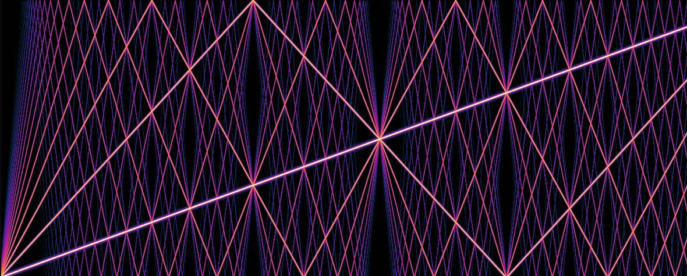
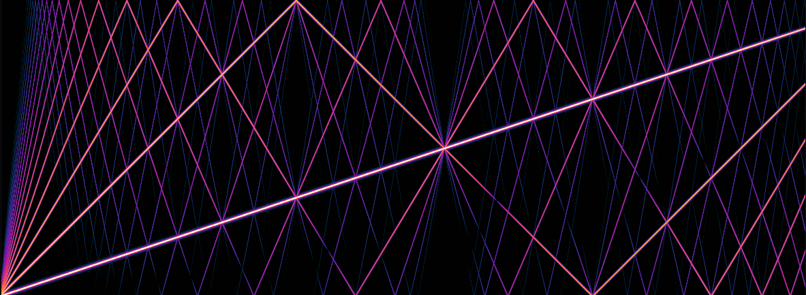
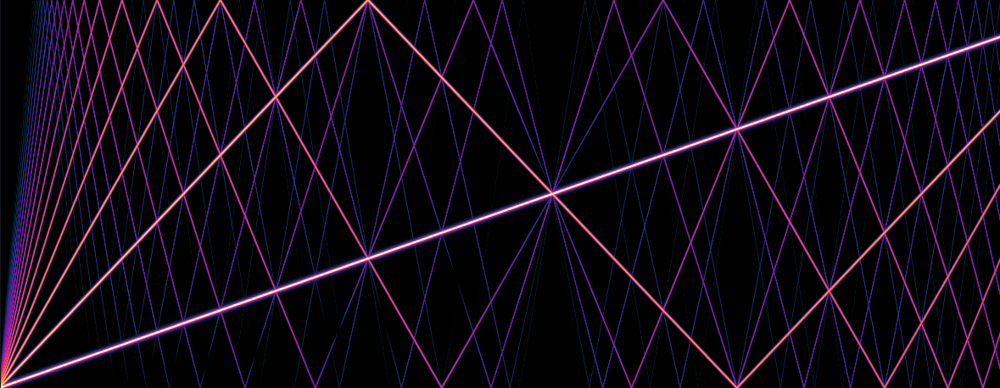

# Anti-Derivative Antialiasing Waveshaping Distortion

This repo contains source code of a $\tanh$ distortion plugin which is antialiased using ADAA. ADAA was first published by Julian D. Parker, Vadim Zavalishin & Efflam Le Bivic in their [2016 DAFx paper](https://dafx16.vutbr.cz/dafxpapers/20-DAFx-16_paper_41-PN.pdf).

## Math
### Quick Derivation
With ADAA the waveshaping function $y[x] = f(x)$ is replaced with
$$y[x] = \frac{F(x) - F(x_{-1})}{x - x_{-1}}$$
where $x$ is the current sample, $x_{-1}$ is the previous sample and $F$ is the antiderivative of $f$.

It is easy to see how this definition relates to the derivative:
$$\frac{\partial F}{\partial x} = \lim_{h \rightarrow 0}\frac{F(x) - F(x + h)}{h}$$
Note that the following holds:
$$\lim_{h \rightarrow 0}\frac{F(x) - F(x + h)}{h} = \lim_{h \rightarrow 0}\frac{F(x) - F(x - h)}{h}$$

Now let $h := x-x_{-1}$. Then we get $x_{-1} = x - h$ and thus:
$$
\lim_{x-x_{-1} \rightarrow 0} \frac{F(x) - F(x_1)}{x - x_{-1}}
$$
Leaving out the limit directly gives us the formula for $y[x]$.

### Ill-Conditioning

When $x - x_{-1}$ becomes very small (i.e. approaches the numerical null-space) the above formula becomes ill-conditioned. The formula needs to take care of that:

$$y[x] = \begin{cases}\frac{F(x) - F(x_1)}{x - x_{-1}} & \text{if } x > \varepsilon\\
\frac{x + x_{-1}}{2} &\text{otherwise}
\end{cases}$$

## Transparent ADAA (M. Vicanek)

Next to the [original ADAA method](https://dafx16.vutbr.cz/dafxpapers/20-DAFx-16_paper_41-PN.pdf), I implemented [Vicanek's version](https://vicanek.de/articles/AADistortion.pdf) which does not have an impulse response with a 0dB pole at nyquist.

## Interpolation

The following modes are available:
* No interpolation
* Linear interpolation
* Natural cubic spline interpolation

When using linear interpolation of the antiderivative, this results in a bit crushing effect which is very noticeable at low gain.
This disappears for cubic spline interpolation.

## Test Results
Here is the spectogram of a sine sweep run through a $\tanh$-distortion with no oversampling and no antialiasing.

Now the same sweep using 1x-ADAA.

And here with Vicanek's transparent ADAA.

## Roadmap

* Implement oversampling
* Other waveshaping types
* Better DC-Offset Filter
